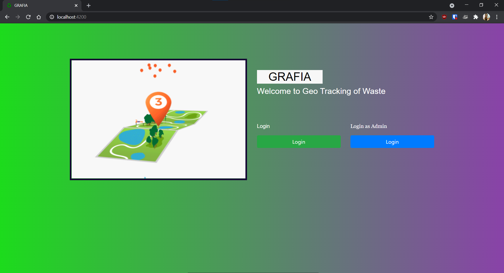
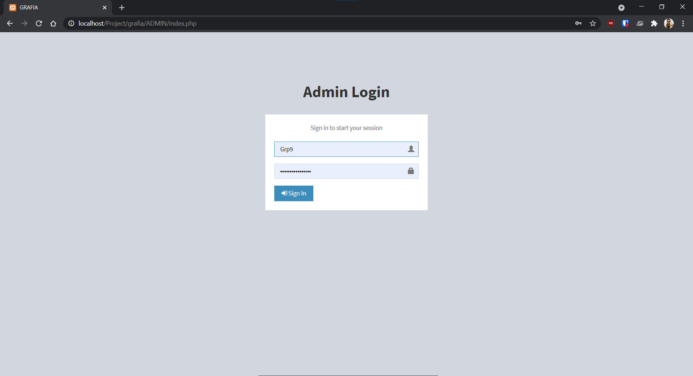
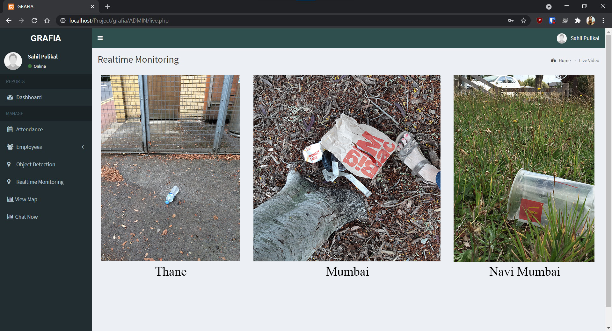
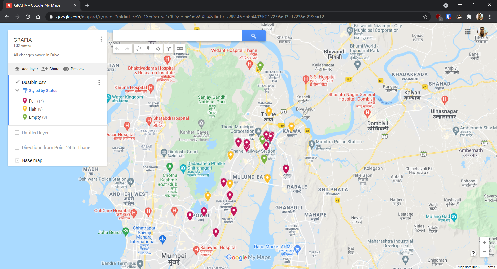
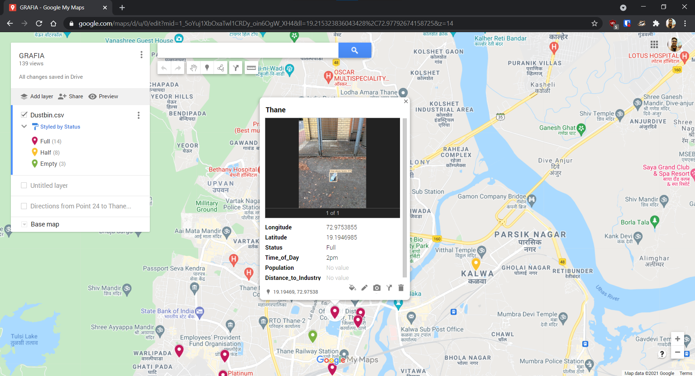
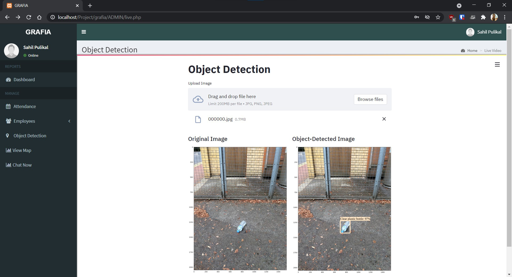
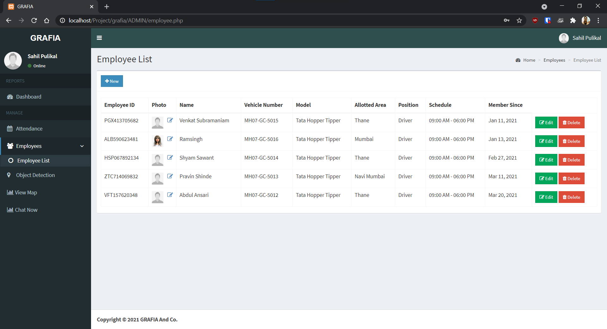
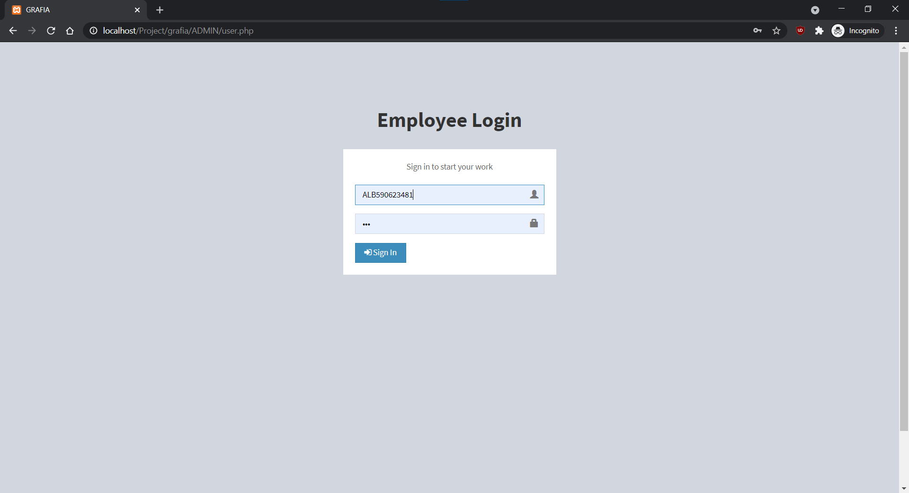
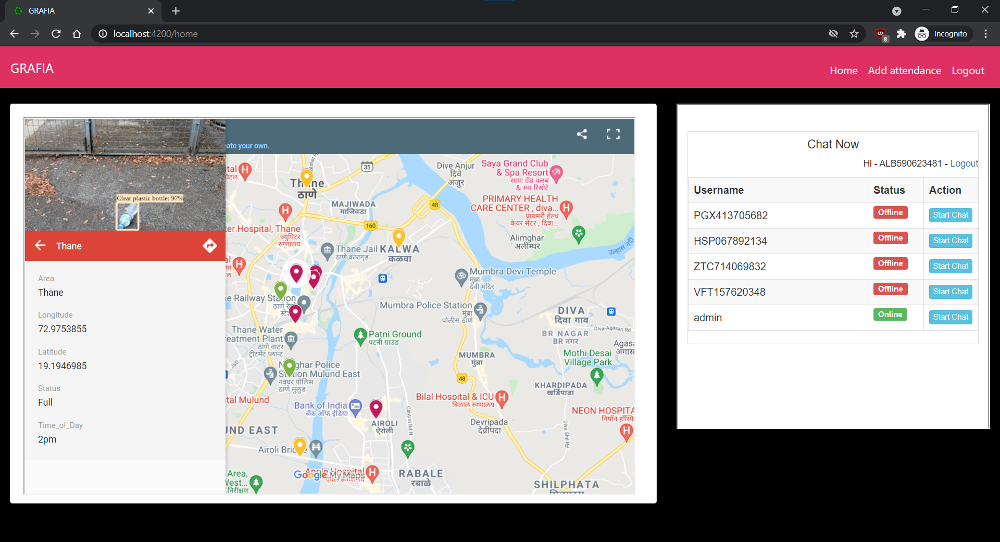

# Geo Tracking of Waste
This repo contains the code for our Final year project.

### Team Members:
1. Sahil Pulikal
2. Haresh Lad
3. Sahil Mirashi

### Software Requirements:
1. TensorFlow 2.0
2. YOLO (You Only Look Once) v3
3. Angular
4. PHP
5. Xampp server
6. OpenCV - Python
7. Google Colab

### To run this project:
1. Run "npm start" in cmd and open http://localhost:4200/
2. Move Project and Chat folder to C:\xampp\htdocs\
3. Run "Object Detection.ipynb" on TPU in Google Colab.

### Screenshots:

<figcaption>Fig. 1: Homepage of Geo Tracking of Waste</figcaption>

<figcaption>Fig. 2: Admin Login Page</figcaption>

<figcaption>Fig. 3: Monitoring of waste </figcaption>

<figcaption>Fig. 4: Map shows the location of areas containing waste</figcaption>

<figcaption>Fig. 5: Map shows object detected image of waste </figcaption>

<figcaption>Fig. 6: Detection of waste</figcaption>

<figcaption>Fig. 7: Garbage Collectors’ Attendance Management System</figcaption>

<figcaption>Fig. 8: Employee login page for Garbage collectors</figcaption>

<figcaption>Fig. 9: Homepage for Garbage Collectors displaying a map along with integrated messaging chat system.</figcaption>

### For any help:
For any help, create an issue on this repo and I'll help.

Feel free to fork and add features to this project by submitting Pull Request.
